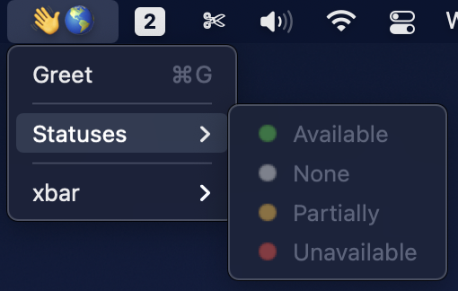

# Hello World Example

This directory contains an xbar plugin written with `xbargo` that says hello to the current user.



## Installation

1. Install xbar: https://github.com/matryer/xbar#install
2. Copy `helloworld.1m.sh` and the `helloworld` go binary into your xbar plugins directory:
    ```bash
    go build ./examples/helloworld
    cp ./examples/helloworld/helloworld.1m.sh $HOME/Library/Application\ Support/xbar/plugins/helloworld.1m.sh
    mv ./helloworld $HOME/Library/Application\ Support/xbar/plugins
    ```
3. Reload xbar
